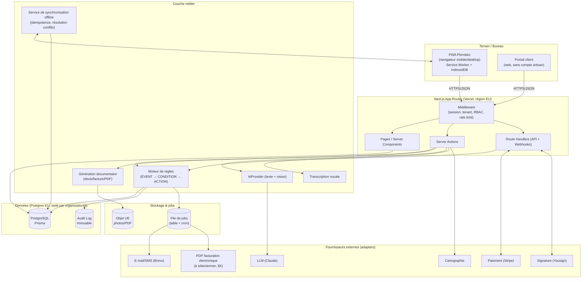

# PLOMBÉO — Phase 0 : Architecture

> « Votre métier. Simplement mieux géré. »
> Document produit par l'équipe architecture/produit — **aucun code métier n'a été écrit à ce stade**, conformément à la consigne. Ce document est la base de discussion à valider avant tout développement.

Statut : **BROUILLON POUR VALIDATION**
Portée : V1 mono-artisan, architecture prête pour évolution SaaS multi-artisans.

---

## Sommaire

- [A. Compréhension du produit](#a-compréhension-du-produit)
- [Hypothèses retenues](#hypothèses-retenues)
- [Points nécessitant clarification](#points-nécessitant-clarification)
- [Risques techniques](#risques-techniques)
- [Risques métier](#risques-métier)
- [Risques réglementaires](#risques-réglementaires)
- [B. Incohérences et fonctionnalités déconseillées en V1](#b-incohérences-et-fonctionnalités-déconseillées-en-v1)
- [C. Stack technique recommandée](#c-stack-technique-recommandée)
- [D. Schéma d'architecture](#d-schéma-darchitecture)
- [E. Modèle de données principal](#e-modèle-de-données-principal)
- [F. Principaux workflows métier](#f-principaux-workflows-métier)
- [G. Architecture IA / voix / vision](#g-architecture-ia--voix--vision)
- [H. Architecture offline-first](#h-architecture-offline-first)
- [I. Sécurité / RGPD / multi-tenant](#i-sécurité--rgpd--multi-tenant)
- [J. Intégrations externes recommandées](#j-intégrations-externes-recommandées)
- [K. Facturation électronique française](#k-facturation-électronique-française)
- [L. Découpage en phases](#l-découpage-en-phases)
- [M. Détail par phase](#m-détail-par-phase)
- [N. Décisions à valider](#n-décisions-à-valider)

---

## A. Compréhension du produit

Plombéo est un **SaaS métier vertical** pour plombiers indépendants français, conçu comme un copilote administratif couvrant tout le cycle de vie client (prospect → devis → intervention → facture → paiement → SAV → fidélisation). La V1 cible **un seul utilisateur exploitant** (l'artisan lui‑même), mais l'architecture doit être **multi-tenant dès le premier commit** pour permettre l'ouverture à d'autres artisans sans réécriture.

Trois contraintes structurantes ressortent du cahier des charges :

1. **Mobile / terrain d'abord.** L'utilisateur est sur chantier, mains occupées, réseau instable. Chaque écran doit être utilisable en quelques secondes, au pouce, parfois hors ligne.
2. **Automatiser sans déresponsabiliser.** L'IA et les règles métier doivent réduire la charge administrative, mais **aucune action financièrement, juridiquement ou contractuellement engageante ne doit s'exécuter sans un point de validation humain explicite** (facture émise, remboursement, signature, envoi d'un document juridique, suppression de données).
3. **Conformité française non négociable mais évolutive.** TVA, facturation électronique, mentions légales, RGPD : le produit doit être construit pour encaisser des changements réglementaires sans refonte — donc **règles isolées dans une couche configurable**, jamais codées en dur dans la logique métier.

Ce dépôt contient déjà plusieurs applications « artisan » construites sur un socle commun (RésaZen pour les salons, `electricien-devis` pour un électricien) : Next.js (App Router) + Prisma/PostgreSQL + Tailwind, sessions par cookie signé, abstraction fournisseur (SMS/e‑mail/paiement) avec un mode « Null » simulé par défaut, montants en centimes, statuts explicites, cron Vercel pour les tâches planifiées. Plombéo est un **produit d'une toute autre ampleur** (multi-tenant réel, offline-first, IA vocale/vision, signature électronique, facturation électronique française), mais je recommande de **capitaliser sur ces conventions déjà éprouvées dans le dépôt** plutôt que d'introduire une stack parallèle — voir section C.

⚠️ Note d'environnement : `AGENTS.md` du dépôt indique que la version de Next.js installée comporte des ruptures par rapport aux conventions connues, et demande de consulter `node_modules/next/dist/docs/` avant d'écrire du code. Ceci ne concerne pas cette Phase 0 (aucun code produit) mais devra être fait en ouverture de Phase 1.

## Hypothèses retenues

- H1 — La V1 est utilisée par **un seul artisan à la fois** (pas de salariés), mais avec un modèle de rôles déjà en place pour préparer l'équipe (§49).
- H2 — Le produit est **100 % France métropolitaine**, TVA française standard, langue française uniquement (§53).
- H3 — L'artisan est en **entreprise individuelle ou société unipersonnelle**, assujetti à la TVA (le cas de la franchise en base TVA — mentions « TVA non applicable, art. 293 B du CGI » — doit rester configurable, cf. §K).
- H4 — Le paiement en ligne passe par un **PSP tiers conforme PCI-DSS** (Stripe pressenti, à valider §N) ; Plombéo ne stocke jamais de données de carte.
- H5 — La signature électronique demandée est de niveau **simple/avancé** (devis, bon d'intervention) et non qualifiée (§38) — à confirmer, un niveau qualifié impliquerait un prestataire eIDAS spécifique et un coût très supérieur.
- H6 — Le stockage de fichiers (photos, PDF) se fait chez un hébergeur **UE**, avec URLs signées à durée limitée, jamais de bucket public.
- H7 — Le mode offline vise les opérations *terrain* (fiche intervention, notes, photos, temps, fournitures) — pas la création complète d'un devis multi-lignes complexe hors-ligne, qui reste un cas secondaire (§N).
- H8 — L'IA vocale/vision utilise un **fournisseur externe** (transcription + LLM), jamais un traitement "magique" simulé ; en l'absence de clé API configurée, la fonctionnalité est désactivée proprement (même pattern que les intégrations SMS/e-mail déjà en place dans le dépôt), jamais fictive.

## Points nécessitant clarification

Ces points bloquent des choix d'architecture significatifs et sont repris en §N :

1. Le PSP de paiement (Stripe est déjà intégré ailleurs dans le dépôt — à confirmer comme standard Plombéo).
2. Le fournisseur de signature électronique (Yousign, français, est recommandé §J — à valider).
3. Le fournisseur e-mail/SMS transactionnel (Brevo est déjà utilisé dans le dépôt).
4. Le modèle exact d'hébergement (mono-instance mutualisée vs. schéma-par-tenant) une fois le nombre d'artisans cible connu.
5. Le statut TVA par défaut de l'artisan pilote (régime réel simplifié, franchise en base, etc.).
6. Le niveau de signature électronique réellement exigé par l'usage (simple suffit-il pour un devis de travaux ?).
7. La cible calendaire de la facturation électronique obligatoire pour le profil de l'artisan pilote (micro-entreprise vs société), qui conditionne l'urgence de l'intégration PDP (§K).
8. Faut-il une appli mobile native (Store) en plus de la PWA, ou la PWA suffit-elle en V1 (§H recommande PWA seule) ?

## Risques techniques

- **Résolution de conflits offline** (deux appareils modifient la même intervention) : complexité réelle, sous-estimée si traitée tardivement — traiter le modèle de synchronisation dès Phase 1/3, pas en Phase 12 uniquement (voir §N).
- **Cohérence des documents financiers** (devis/facture PDF figés) sous forte concurrence d'écriture : nécessite verrouillage et versionnement explicites (§14, §56).
- **Dépendance à des fournisseurs IA externes** pour la voix/vision : latence, coût, disponibilité, dérive de qualité — imposer une abstraction (adapter) et un mode dégradé sans IA.
- **Montée en charge multi-tenant** si le modèle de données ou les index ne sont pas pensés pour le filtrage systématique par `organizationId` dès le départ.
- **Version de Next.js non standard** dans ce dépôt (cf. `AGENTS.md`) : risque de régressions si on code par réflexe sur des connaissances Next.js génériques sans relire la doc locale.

## Risques métier

- Vouloir livrer trop de modules avant d'avoir un cœur (client → devis → facture → paiement) réellement fiable et adopté — risque de dilution (voir §B).
- Automatisations mal calibrées (relances trop agressives, tarification d'urgence mal comprise) qui dégradent la relation client de l'artisan.
- Sur-promesse sur l'IA (diagnostic, reconnaissance d'équipement) qui engage la responsabilité perçue du plombier — d'où l'exigence contractuelle du §22 (l'IA ne remplace jamais le diagnostic professionnel).

## Risques réglementaires

- **Facturation électronique France** : calendrier et modalités précises encore sujettes à ajustements réglementaires jusqu'à leur entrée en vigueur effective — **[À VÉRIFIER — SOURCE OFFICIELLE : impots.gouv.fr / economie.gouv.fr]**, voir §K. Ne jamais figer une date en dur dans le code.
- **RGPD** : la conformité technique (chiffrement, minimisation, consentement) n'équivaut pas à une garantie juridique — une revue juridique reste nécessaire avant mise en production réelle (§45).
- **Signature électronique** : le niveau requis (simple/avancé/qualifié) dépend de la valeur juridique recherchée pour le document signé — **[À VÉRIFIER avec un juriste ou le prestataire de signature]**.
- **Mentions légales devis/factures, pénalités de retard, indemnité forfaitaire de recouvrement** : montants et taux réglementaires à sourcer officiellement au moment de l'implémentation Phase 5, jamais recopiés de mémoire.

---

## B. Incohérences et fonctionnalités déconseillées en V1

Le cahier des charges est volontairement exhaustif (vision produit à long terme). Pour rester fidèle au principe « le plombier doit passer le moins de temps possible sur l'administratif » **sans** construire un ERP illisible dès le jour 1, je déconseille en V1 :

| Fonctionnalité listée | Pourquoi la repousser | Où elle réapparaît |
|---|---|---|
| Rôles complets (apprenti, sous-traitant, expert-comptable) §49 | Un seul utilisateur en V1 : le modèle de rôles doit **exister** en base mais l'UI n'a besoin que de Propriétaire/Admin. | Phase 14, à l'ouverture multi-utilisateurs |
| Abonnements SaaS complets, coupons, portail self-service §50 | Un seul tenant payant (ou aucun) en V1 : préparer le modèle `Plan`/`Subscription`, ne pas construire le portail. | Phase 14 |
| Back-office éditeur complet §51 | Aucune valeur pour l'artisan pilote ; juste un accès admin technique suffit en V1. | Phase 14 |
| Multilinguisme | Explicitement exclu par le cahier des charges (§53) — mais toutes les chaînes doivent passer par une couche de libellés dès le départ pour ne pas devoir tout réécrire plus tard. | — |
| Signature qualifiée eIDAS (le plus haut niveau) | Coût et complexité disproportionnés tant que le besoin juridique exact n'est pas confirmé (H5). Commencer en signature simple/avancée via prestataire spécialisé. | À réévaluer si un client l'exige |
| Devis à variantes (Essentiel/Confort/Premium) en tout premier incrément du module devis | Vraie valeur, mais complexifie le modèle de données (versions/options) dès le départ. Le faire juste après le devis simple, pas en même temps. | Fin Phase 4 |
| Optimisation de tournée algorithmique avancée §30 | Un plombier seul a rarement plus de 3-5 RDV/jour : un tri simple par horaire + lien GPS suffit largement. L'optimisation multi-contraintes est un gain marginal pour un coût de développement élevé. | Signalé comme sur-ingénierie, à ne construire que sur demande explicite |
| Prédictif avancé (prévision de CA par ML) §29 | Sans historique de données, un modèle prédictif est peu fiable. Commencer par des statistiques descriptives simples (moyennes glissantes) clairement étiquetées « estimation ». | Phase 9+, en restant simple |
| Application mobile native (Store) en plus de la PWA | Double la surface de maintenance pour un gain UX marginal si la PWA est bien faite (voir §H4). | Réévaluation post-V1 si le besoin de notifications push iOS avancées ou d'accès matériel bas niveau se confirme |
| Commande automatique de stock auprès des fournisseurs | Explicitement à proscrire par le cahier des charges lui-même (§25) sans règle et autorisation explicites — confirmé : l'IA suggère, ne commande jamais seule. | — |

Aucune de ces fonctionnalités n'est retirée du produit — elles sont **replanifiées** pour que le cœur (Client → Devis → Facture → Paiement → Intervention) soit solide avant d'empiler des couches.

---

## C. Stack technique recommandée

Le dépôt contient déjà trois applications artisan (RésaZen, `electricien-devis`, `resto-pilot`) bâties sur un socle cohérent et déjà en production réelle (Stripe, Brevo, Prisma, Vercel). Recommandation : **prolonger ce socle** pour Plombéo plutôt que d'introduire une stack concurrente — cohérence d'équipe, code déjà audité, coût de portage nul. Les écarts (offline-first, IA voix/vision, queue de jobs) sont ajoutés au-dessus.

| Composant | Technologie retenue | Pourquoi | Alternative | Avantages | Inconvénients | Coût/complexité | Risques |
|---|---|---|---|---|---|---|---|
| **Frontend + Backend** | Next.js (App Router) + React, TypeScript strict | Déjà le standard du dépôt ; Server Actions + Route Handlers couvrent web, API mobile future et webhooks dans un seul projet | Remix, SvelteKit + API séparée | Un seul déploiement, SSR performant sur mobile, écosystème riche | Version locale du dépôt "non standard" (cf. `AGENTS.md`) → doc locale à relire | Faible (équipe déjà formée) | Rupture de convention si on code par réflexe sans lire la doc locale |
| **Base de données** | PostgreSQL (hébergé UE : Neon EU, Supabase EU-Frankfurt, ou Scaleway) | Déjà utilisé partout dans le dépôt ; relationnel adapté à un modèle métier riche avec forte intégrité (montants, statuts, FK) | MySQL, CockroachDB | RLS possible, JSON natif pour les données semi-structurées (carnet technique), écosystème Prisma mature | Aucun majeur | Faible-moyen | Choix du niveau d'isolation multi-tenant à trancher (§I) |
| **ORM** | Prisma 7 (`@prisma/adapter-pg`) | Déjà utilisé, migrations versionnées, typage bout-en-bout | Drizzle ORM | Prisma Client généré = sécurité de type forte | Génération de client à surveiller en CI | Faible | — |
| **Auth** | Session cookie signée (`jose`) + `bcryptjs`, évolutive vers MFA (TOTP) | Déjà le pattern du dépôt, simple et maîtrisé, pas de dépendance à un IdP tiers coûteux pour une V1 mono-tenant | Auth.js, Clerk, WorkOS | Zéro dépendance externe, coût nul, plein contrôle RGPD | MFA et SSO à coder à la main plus tard | Faible en V1 ; moyen si SSO entreprise requis en Phase 14 | Un IdP managé (Clerk/WorkOS) redevient pertinent si l'onboarding self-service multi-tenant s'accélère — à réévaluer |
| **Validation** | Zod (déjà présent) partagé client/serveur | Cohérent avec le reste du dépôt, validation serveur systématique (§46) | Valibot | Léger, déjà en place | — | Faible | — |
| **Stockage fichiers** | Objet compatible S3, région UE (Scaleway Object Storage ou Cloudflare R2 UE, ou stockage Supabase si Supabase choisi comme BDD) + URLs signées | Photos chantier, PDF, documents : volumétrie et coût imposent un stockage objet, pas la BDD | AWS S3 (hors UE par défaut) | Coût prévisible, souveraineté UE | Un fournisseur de plus à opérer | Faible-moyen | Vérifier la localisation réelle des régions au contrat |
| **PWA / mobile** | **PWA (Progressive Web App)** avec Service Worker + manifest, un seul code base avec le web | Voir argumentaire détaillé §H4 | React Native / Flutter (app native) | Un seul code à maintenir, déploiement instantané (pas de review Store), accès offline/caméra/géoloc suffisant via API Web | Pas d'accès à certaines API matérielles avancées iOS, push iOS historiquement plus limité (désormais supporté depuis iOS 16.4+) | Faible (pas de stack supplémentaire) | Si le besoin de fonctionnalités natives profondes émerge (ex. Bluetooth), réévaluer |
| **Offline / cache local** | IndexedDB via une petite couche d'accès (Dexie.js) + file de synchronisation applicative | Stockage structuré côté client, requêtable, plus robuste que `localStorage` pour des entités métier | WatermelonDB, RxDB | Léger, contrôle total du protocole de sync (nécessaire pour l'idempotence métier) | Sync à concevoir soi-même (pas de solution clé-en-main fiable pour ce cas métier) | Moyen | Concevoir la stratégie de conflit dès Phase 1 (§H) |
| **Queue / jobs planifiés** | Vercel Cron (déjà utilisé) pour le déclenchement + **table `AutomationExecution`/`Job` en base comme file d'attente** avec verrouillage optimiste, pour les relances, la synchro et les automatisations | Évite d'introduire un service de queue externe pour un seul tenant en V1, tout en gardant l'idempotence et l'auditabilité exigées (§58) | Inngest, Trigger.dev, BullMQ+Redis | Pas de nouvelle brique d'infra en V1 | À revoir si le volume de jobs explose en multi-tenant | Faible en V1 | Migrer vers Inngest/Trigger.dev (tous deux disponibles en région UE) si le volume ou la complexité de retry l'exige (Phase 14+) |
| **Cache** | Cache HTTP/Next.js natif + cache applicatif ciblé (ex. résultats de recherche) ; pas de Redis en V1 | Le volume mono-tenant ne justifie pas Redis dès le départ | Redis (Upstash, région UE) | Simplicité | Moins de contrôle fin | Faible | Introduire Redis (Upstash EU) si le rate-limiting distribué ou le multi-instance l'exige (Phase 15) |
| **Recherche** | Recherche PostgreSQL native (`tsvector`/trigram) pour la recherche globale (§42) | Le volume d'un artisan ne justifie pas un moteur dédié | Meilisearch, Typesense (self-host UE) | Une brique de moins | Moins puissant en langage naturel complexe | Faible | Passer à Meilisearch si le multi-tenant à grande échelle le justifie |
| **IA texte (assistant, extraction vocale, rédaction)** | API LLM externe (Claude, Anthropic) via une couche `AiProvider` abstraite | Qualité de raisonnement structuré, function calling fiable pour extraire des entités métier depuis la voix | OpenAI GPT, Mistral (option souveraine UE) | Bonne qualité d'extraction structurée | Dépendance externe, coût à l'usage | Moyen | Toujours un mode dégradé "sans IA" fonctionnel ; Mistral (français/UE) comme option de repli souveraineté |
| **Transcription vocale** | API de speech-to-text (ex. Whisper via un fournisseur, ou service dédié) via un adapter | Nécessaire pour "Parler à mon assistant" (§20) | Solution on-device (Web Speech API) en secours simple | Web Speech API = gratuit, dispo hors-ligne partielle sur certains navigateurs, mais qualité variable | Qualité/langue variable | Faible-moyen | Commencer avec Web Speech API navigateur (coût nul) puis fournisseur dédié si besoin de fiabilité supérieure |
| **Vision (analyse photo)** | API multimodale du même fournisseur LLM (Claude) via l'adapter `AiProvider` | Un seul fournisseur à opérer pour texte + vision | Google Vision API dédiée | Simplicité d'intégration | — | Moyen | Toujours présenter les déductions comme non certaines (§22) |
| **PDF (devis, factures)** | Génération native navigateur (impression) réutilisée comme dans `electricien-devis`, migrée vers un moteur serveur (ex. `@react-pdf/renderer` ou Playwright headless) dès que l'envoi automatique par e-mail/portail client est requis | Le rendu serveur est nécessaire pour joindre un PDF à un e-mail automatique ou générer une facture figée sans dépendre du navigateur du client | Service PDF externe (DocRaptor...) | Pas de nouvelle dépendance externe payante | Rendu serveur à maintenir | Faible-moyen | — |
| **E-mail transactionnel** | Brevo (déjà intégré dans le dépôt) via adapter `EmailProvider` | Cohérence avec l'existant, capacité SMTP+API+SMS chez un seul fournisseur EU | Resend (déjà utilisé dans `electricien-devis`), Sendgrid | Fournisseur français/UE, un seul contrat pour e-mail+SMS | — | Faible | — |
| **SMS** | Brevo (déjà utilisé dans RésaZen) | Idem | Twilio (hors UE) | UE, cohérent avec l'existant | Coût par SMS | Faible | — |
| **Paiement** | Stripe (déjà intégré dans deux apps du dépôt) via adapter `PaymentProvider`, Stripe Connect si Plombéo doit un jour reverser des fonds | Conformité PCI-DSS déléguée, webhooks robustes, Checkout + Billing Portal déjà maîtrisés dans l'équipe | Adyen, GoCardless (prélèvement) | Aucune donnée carte stockée, SCA gérée | Société non-UE (traitement conforme RGPD via clauses contractuelles, mais à noter) | Faible (déjà en place) | Vérifier le choix Stripe pour la facturation électronique réglementaire (Stripe n'est pas un PDP) — voir §K |
| **Signature électronique** | Yousign (français, eIDAS, simple/avancée) via adapter `SignatureProvider` | Acteur français, conformité eIDAS documentée, API claire | DocuSign, Universign | Fournisseur français, support FR | Coût par signature | Moyen | Niveau de signature à confirmer (H5) |
| **Cartographie / itinéraires** | API cartographique — recommandé : **Google Maps Platform** (précision, ETA fiable) avec option souveraine **Mapbox ou OpenRouteService/IGN** si la souveraineté prime | Le besoin (temps de trajet fiable, ouverture GPS) est mieux couvert par Google/Mapbox que par une solution 100% UE actuellement moins mature sur les ETA | OpenStreetMap + OSRM auto-hébergé | Souveraineté totale si auto-hébergé | Précision ETA généralement inférieure | Moyen | Décision business à trancher (§N) : précision vs souveraineté |
| **Observabilité** | Sentry (erreurs, région UE disponible) + logs structurés Vercel/host | Standard du marché, région EU configurable | Better Stack, Grafana Cloud | Mise en place rapide | Coût à l'usage | Faible | Configurer explicitement la région EU |
| **Hébergement** | Voir comparatif dédié ci-dessous | — | — | — | — | — | — |
| **CI/CD** | GitHub Actions (déjà présent dans `.github/`) + déploiement Vercel/hébergeur choisi | Déjà en place | GitLab CI | — | — | Faible | — |
| **Tests** | Vitest (déjà en place) + Playwright pour l'E2E | Cohérent avec l'existant | Jest | — | — | Faible | — |

### Hébergement — comparatif dédié (§65)

| Option | Localisation | Sécurité/Conformité | Coût | Sauvegardes | Scalabilité | Simplicité | Dépendance fournisseur |
|---|---|---|---|---|---|---|---|
| **Vercel (régions EU) + Neon/Supabase EU pour Postgres** *(recommandé V1)* | App : régions EU configurables ; société éditrice US (clauses contractuelles types) | Bon niveau, mais société non-UE — à documenter dans le registre RGPD | Faible en V1 (paliers gratuits/pro) | Gérées par le fournisseur BDD | Excellente, scale automatique | Très simple, déjà maîtrisé dans le dépôt | Moyenne — migration Next.js standard reste possible ailleurs |
| **Scaleway (France) full-stack** (Serverless Containers/Kubernetes + Database + Object Storage) | 100 % France | Hébergeur souverain, SecNumCloud en cours sur certaines offres | Légèrement supérieur à Vercel à petite échelle | À la charge de l'équipe (services managés dispo) | Bonne, demande plus de configuration | Moyenne (plus d'assemblage manuel) | Faible — infra standard (containers), portable |
| **OVHcloud (France)** | 100 % France | Réputation FR forte, SecNumCloud disponible | Compétitif | Managé | Bonne | Moyenne | Faible |
| **Auto-hébergé UE générique (Hetzner + Coolify/Dokku)** | UE (choix du datacenter) | Dépend entièrement de la configuration de l'équipe | Le plus faible | À construire soi-même | Demande du DevOps | Faible (plus de travail d'exploitation) | Très faible (portable) |

**Recommandation V1** : démarrer sur **Vercel + base Postgres EU (Neon ou Supabase, région Francfort)**, cohérent avec l'existant du dépôt, coût quasi nul à faible volume, mise en production rapide. **Point de vigilance RGPD à documenter** : Vercel est une société américaine — s'assurer de clauses contractuelles types / configuration des régions de traitement en EU, et prévoir la **réversibilité** vers Scaleway/OVHcloud comme option de repli si un client (ou le marché B2B artisan) exige un hébergement français strict. Ce choix est un sujet de validation (§N).

---

## D. Schéma d'architecture



Principes :

- **Un seul déploiement applicatif** (monolithe modulaire Next.js) en V1 — évite la complexité opérationnelle de microservices pour un produit mono-tenant. Les frontières de modules (clients, devis, factures, IA…) restent nettes en code pour permettre une extraction ultérieure si besoin.
- **Tout accès aux données passe par un contexte tenant** injecté en middleware (`organizationId` résolu depuis la session), jamais par un ID brut non vérifié (§I).
- **Tous les fournisseurs externes sont derrière un adapter** (`PaymentProvider`, `SignatureProvider`, `EmailProvider`, `AiProvider`…), avec un mode « Null » explicite en dev/démo — jamais de simulation silencieuse en production (§76).

---

## E. Modèle de données principal

Modèle corrigé et complété par rapport à la liste indicative du cahier des charges. Toutes les entités sont scopées par `organizationId` (sauf `Organization`, `Plan`, `AuditLog` d'infrastructure). Montants en **centimes** (entiers), quantités en **milli-unités** — conventions déjà en place dans `electricien-devis`.

### Groupes d'entités

**Tenant & accès**
`Organization`, `User`, `Membership` (rôle par organisation), `Role`, `Permission`, `Invitation`, `Session`

**CRM**
`Client` (particulier/professionnel), `Address`, `Property` (logement/site = carnet technique), `Equipment` (chauffe-eau, chaudière… rattaché à `Property`), `Consent`

**Cycle commercial**
`Lead`/`EmergencyRequest` (demande entrante), `Appointment`, `Quote`, `QuoteOption` (variantes Essentiel/Confort/Premium), `QuoteLine`, `Signature`

**Exécution**
`Intervention`, `InterventionTask`, `TimeEntry`, `Photo`, `Note`

**Financier**
`Invoice`, `InvoiceLine`, `CreditNote`, `Payment`, `Expense`, `Purchase`

**Catalogue & ressources**
`Service` (prestation), `Product` (fourniture), `PriceListItem`, `Supplier`, `StockItem`, `StockMovement`

**Contrats & garanties**
`MaintenanceContract`, `Warranty`

**Communication**
`Message`, `Notification`, `Document`

**Système**
`AutomationRule`, `AutomationExecution`, `AuditLog`, `AiAction` (traçabilité des actions IA — voir §G), `Subscription`, `Plan`, `SupportTicket`

### Différences notables par rapport à la liste indicative du cahier des charges

- **`EmergencyRequest` fusionnée dans un `Lead` générique** avec un champ `urgency` — une urgence est une demande entrante comme une autre, avec une priorité différente, pas une entité métier séparée. Simplifie le modèle et le moteur de règles.
- **`AiAction` ajoutée** (absente de la liste indicative) : trace **chaque** action IA (type INFORMATION/RECOMMANDATION/BROUILLON/ACTION_AUTOMATIQUE/ACTION_VALIDATION_REQUISE, entrée, sortie, statut de validation, utilisateur validateur) — impératif du §21/§57.
- **`QuoteVersion` remplacée par un couple `Quote` (dossier) + `QuoteOption` (variante figée)** plutôt qu'une version linéaire : modélise mieux le besoin réel « 3 propositions dans un même devis » du §13.
- **`PriceListItem`** ajoutée pour séparer le **catalogue** (`Service`/`Product`, réutilisable) du **prix pratiqué** (peut varier par client pro / contrat), évitant de dupliquer le catalogue.
- **`Session` explicite** en base (pas seulement un cookie signé stateless) pour permettre la **révocation** (§46) — le cookie signé actuel du dépôt (`jose`) reste la base cryptographique, mais une table de sessions actives est nécessaire pour « déconnecter tous mes appareils » et l'audit de connexion.
- **`Document` comme entité de GED transverse**, distincte des entités métier qui la génèrent (`Quote`, `Invoice`…) — un document a un cycle de vie propre (classement, tags, rétention) même s'il est *produit par* un devis.

### Extrait de schéma (indicatif, non normatif — le détail exact est produit en Phase 1/2)

```
Organization 1---N Membership N---1 User
Organization 1---N Client 1---N Property 1---N Equipment
Organization 1---N Client 1---N Appointment
Organization 1---N Lead (urgency: NONE|SOIR|NUIT|WEEKEND|FERIE)
Client 1---N Quote 1---N QuoteOption 1---N QuoteLine
QuoteOption 0..1---1 Signature
Quote 1---N Invoice (facture d'acompte / finale)
Invoice 1---N InvoiceLine
Invoice 1---N Payment
Invoice 0..N---0..N CreditNote
Appointment 0..1---0..1 Intervention 1---N InterventionTask
Intervention 1---N TimeEntry
Intervention 1---N Photo
Property 1---N MaintenanceContract
Equipment 1---N Warranty
Organization 1---N StockItem 1---N StockMovement
Organization 1---N AutomationRule 1---N AutomationExecution
(*) 1---N AuditLog   (* = toute entité sensible)
(*) 1---N AiAction
```

### États explicites (voir aussi §56 et machines à états §F)

- `Lead.status` : NOUVEAU → QUALIFIE → CONVERTI / ABANDONNE
- `Quote.status` : DRAFT → READY → SENT → VIEWED → ACCEPTED / DECLINED / EXPIRED / CANCELLED
- `Invoice.status` : DRAFT → ISSUED → SENT → PARTIALLY_PAID → PAID / OVERDUE ; correction via `CreditNote` (jamais d'édition silencieuse d'une facture émise, §14/§56)
- `Intervention.status` : PLANIFIEE → EN_COURS → TERMINEE → CLOTUREE (compte rendu validé)
- `Payment.status` : EN_ATTENTE → CONFIRME / ECHEC / REMBOURSE
- `SyncQueueItem.status` : PENDING → SYNCING → SYNCED / CONFLICT / FAILED (§H)

---

## F. Principaux workflows métier

### Workflow principal (cycle de vie client)

```
PROSPECT → DEMANDE → RENDEZ-VOUS → DEVIS → ACCEPTATION → SIGNATURE
  → ACOMPTE → INTERVENTION → COMPTE RENDU → FACTURE → PAIEMENT
  → GARANTIE/SAV → ENTRETIEN → FIDÉLISATION
```

Chaque flèche correspond à un **événement métier journalisé** (`AuditLog` + déclencheur potentiel du moteur de règles, §18). Aucune étape n'est obligatoire dans l'absolu (un client peut appeler directement pour un devis sans demande en ligne), mais l'ordre logique est respecté par les statuts des entités concernées.

### Workflow détaillé — Urgence

1. Client (ou artisan) qualifie une urgence (photo, description, adresse) → `Lead(urgency=...)`
2. Le système vérifie le planning, propose un créneau prioritaire
3. Les règles tarifaires **configurées par l'artisan** (pas de règle légale supposée, §11) s'appliquent au futur devis/facture
4. Confirmation → `Appointment` prioritaire créé, notification à l'artisan (canal URGENT, §41)

### Workflow détaillé — Devis à variantes

1. Création depuis une intervention, la voix, ou manuellement → `Quote(status=DRAFT)`
2. Ajout d'une ou plusieurs `QuoteOption` (Essentiel/Confort/Premium), chacune avec ses `QuoteLine`
3. Passage à `READY` (validation artisan) → génération PDF → `SENT`
4. Client consulte via portail (`VIEWED`), choisit une option, signe (`Signature`) → `ACCEPTED`
5. Si acompte requis (règle configurable, §18) → lien de paiement → `Payment`
6. À l'acceptation : création automatique de l'`Intervention` planifiée (brouillon), jamais de facture automatique sans validation

### Workflow détaillé — Facturation

1. Intervention `TERMINEE` avec compte rendu validé par l'artisan → proposition de facture (jamais auto-émise sans clic de validation, §59)
2. `Invoice(status=DRAFT)` généré depuis le devis accepté ou l'intervention → vérification artisan → `ISSUED` (numérotée, **figée**, §14)
3. Envoi (`SENT`) → suivi paiement (`PARTIALLY_PAID`/`PAID`) → si dépassement d'échéance, `OVERDUE` déclenche le moteur de relances (§17)
4. Toute correction après émission passe par un `CreditNote`, jamais une réécriture (§14/§56)

### Workflow détaillé — Commande vocale ("Parler à mon assistant")

Voir détail technique en §G. Résumé fonctionnel :

```
Voix → Transcription → Extraction d'entités (LLM) → Résumé structuré présenté à l'artisan
   → [Validation humaine] → Application des modifications → Journalisation (AiAction)
```

Aucune facture, aucun envoi client, aucun paiement n'est déclenché directement par une commande vocale sans passage par l'écran de confirmation (§20/§59).

---

## G. Architecture IA / voix / vision

### Principes directeurs (non négociables, cf. cahier des charges §20-22, §57, §59)

1. **Toute sortie IA est classée** dans l'une des 5 catégories : `INFORMATION`, `RECOMMANDATION`, `BROUILLON`, `ACTION_AUTOMATIQUE`, `ACTION_VALIDATION_REQUISE`.
2. **Toute action IA est journalisée** dans `AiAction` (entrée, modèle utilisé, sortie brute, décision finale, utilisateur qui a validé/rejeté, horodatage).
3. **Aucune action à impact financier ou juridique n'est de catégorie `ACTION_AUTOMATIQUE`** — systématiquement `ACTION_VALIDATION_REQUISE`.
4. **Dégradation propre** : sans clé API IA configurée, les fonctionnalités IA sont désactivées avec un message clair (jamais de réponse simulée présentée comme réelle, §76).

### Pipeline voix

```
Micro (navigateur, Web Speech API ou enregistrement + upload)
  → Transcription (fournisseur STT)
  → Prompt structuré vers LLM avec function calling
     (schéma strict : entités = client, intervention, tâches, fournitures, temps, action demandée)
  → Résultat structuré (JSON validé par Zod)
  → Écran de confirmation ("Voici ce que j'ai compris — [Modifier] [Valider]")
  → Exécution des Server Actions correspondantes seulement après validation
  → AiAction journalisée avec le lien vers l'entité modifiée
```

En cas d'ambiguïté détectée (champ requis manquant, montant incohérent, client non identifié avec certitude) → le système **pose une question de clarification** plutôt que de deviner (§20 point 4).

### Pipeline vision (photos chantier)

```
Photo uploadée (Intervention)
  → Analyse par le modèle multimodal (description, éléments visibles, classement avant/après)
  → Sortie présentée comme "suggestion" (catégorie RECOMMANDATION), jamais comme un diagnostic
  → L'artisan peut accepter/éditer/rejeter chaque suggestion avant qu'elle alimente un devis ou un compte rendu
```

Rappel explicite (§22) : le produit **n'affirme jamais** identifier une pièce ou un équipement avec certitude — toujours au conditionnel, avec un niveau de confiance explicite si le modèle le fournit.

### Assistant contextuel

Un service `AssistantService` interroge les données de l'organisation courante (toujours filtré `organizationId`, jamais d'accès cross-tenant) pour répondre à des requêtes en langage naturel (§42, ex. « factures impayées depuis plus de 15 jours ») en traduisant la requête en filtre structuré exécuté côté base — **le LLM ne génère jamais de SQL exécuté directement** (surface d'attaque), il choisit parmi des requêtes prédéfinies paramétrées.

---

## H. Architecture offline-first

### Portée du offline en V1 (cf. hypothèse H7, à valider §N)

Fonctionnalités disponibles hors-ligne : consultation des RDV du jour et des infos client essentielles (données déjà synchronisées), création/modification d'intervention, notes, photos, saisie fournitures/temps passé, préparation d'éléments de devis (brouillon local). La signature hors-ligne est possible techniquement (capture) mais son **horodatage de valeur juridique** n'est validé qu'au moment de la synchronisation — ceci doit être explicite pour l'utilisateur.

### Architecture technique

- **Stockage local** : IndexedDB (via Dexie.js) contenant un sous-ensemble synchronisé des données de l'organisation (RDV à venir, clients actifs, interventions en cours) + une **file de mutations locales** (`SyncQueueItem`).
- **Chaque mutation locale porte un identifiant client généré (UUID)**, créé **au moment de la saisie**, jamais côté serveur — condition nécessaire à l'idempotence (§5).
- **File de synchronisation** : à la reconnexion, chaque `SyncQueueItem` est envoyé avec son UUID client ; le serveur fait un **upsert idempotent** (`WHERE clientMutationId = ...`) — un rejeu réseau ne crée jamais de doublon (§5 exigence explicite « protection contre les doublons »).
- **États de synchronisation** exposés à l'UI par entité : `LOCAL_ONLY` (créé hors-ligne, pas encore envoyé), `SYNCING`, `SYNCED`, `CONFLICT`, `FAILED` — jamais un état binaire caché.
- **Résolution de conflits** : stratégie par défaut **dernière écriture serveur gagnante sur les champs simples**, mais **fusion additive sur les collections** (ex. deux photos ajoutées hors-ligne sur la même intervention par deux appareils = les deux sont conservées, pas d'écrasement). Les conflits non résolvables automatiquement (ex. deux modifications concurrentes du même champ texte) sont **remontés explicitement à l'artisan** pour arbitrage — jamais résolus silencieusement quand l'enjeu est financier (ex. deux lignes de devis modifiées en parallèle).
- **Reprise sur erreur** : chaque item de la file conserve un compteur de tentatives et le dernier message d'erreur ; au-delà d'un seuil, il passe en `FAILED` et remonte une notification explicite plutôt que de retenter indéfiniment en silence.
- **Idempotence bout-en-bout** : toute Server Action déclenchée par la synchro est conçue comme idempotente (clé d'idempotence = UUID client), y compris pour les effets de bord (ex. ne pas déclencher deux fois un e-mail de confirmation si la synchro est rejouée).

### Pourquoi PWA plutôt qu'une app native (argumentaire §4)

| Critère | PWA | App native (React Native/Flutter) |
|---|---|---|
| Code unique web + mobile | Oui, un seul code base Next.js | Non, un projet supplémentaire à maintenir |
| Installation | Immédiate, pas de review Store | Délai de validation Store, mises à jour plus lentes à propager |
| Accès offline/caméra/géoloc | Suffisant via Service Worker, IndexedDB, `getUserMedia`, Geolocation API | Plus complet mais pas nécessaire au périmètre V1 |
| Notifications push | Supporté (iOS 16.4+, Android de longue date) | Plus mature historiquement sur iOS, mais l'écart se réduit |
| Coût de développement | Un seul frontend | Effort doublé (ou triplé avec le web) |
| Accès matériel avancé (Bluetooth, NFC) | Limité | Complet |

**Conclusion** : la PWA couvre l'intégralité des besoins terrain listés au §5 avec un seul code base, un déploiement instantané (critique pour un artisan qui a besoin d'un correctif rapide) et un coût de développement très inférieur. Le passage à une app native ne se justifierait que si un besoin matériel précis et non couvert par les API Web apparaissait (à réévaluer, §N).

---

## I. Sécurité / RGPD / multi-tenant

### Multi-tenant

- **Isolation logique dès la V1** : chaque table métier porte `organizationId`, chaque requête Prisma passe par un **repository/service qui injecte systématiquement ce filtre** — jamais de requête « nue » dans une Server Action. Un test automatisé dédié vérifie qu'aucune requête ne peut retourner de données d'une autre organisation (§62, tests multi-tenant obligatoires).
- **Niveau d'isolation recommandé V1** : base partagée + colonne `organizationId` (comme le modèle `Salon` déjà en place dans le dépôt). Suffisant et le plus simple à opérer pour un petit nombre de tenants. **Réévaluer un schéma-par-tenant ou une base par tenant si des exigences contractuelles fortes (grands comptes, secteurs réglementés) l'exigent** — sujet à trancher en Phase 14, pas maintenant.
- Toute action d'automatisation (§18) ou d'IA (§21) exécutée pour le compte d'une organisation est explicitement scopée par ce même `organizationId`, y compris dans les jobs planifiés.

### Sécurité applicative

- Authentification : cookie de session signé (`jose`) + hash `bcrypt`, évolution vers **MFA TOTP obligatoire pour le rôle Propriétaire/Administrateur** dès que le produit gère du paiement en ligne réel.
- **RBAC** : table `Role`/`Permission` avec permissions vérifiées côté serveur systématiquement (jamais seulement côté UI).
- Chiffrement en transit (TLS partout, imposé par l'hébergeur), chiffrement au repos pour les colonnes sensibles (ex. IBAN) selon les capacités de l'hébergeur BDD choisi.
- Protections standards OWASP : validation serveur systématique (Zod), requêtes paramétrées (Prisma protège nativement l'injection SQL), CSRF (Server Actions Next.js incluent une protection native à vérifier/renforcer), en-têtes de sécurité (CSP, HSTS), sanitisation des uploads (type MIME vérifié serveur, limite de taille, re-génération des miniatures plutôt que passthrough).
- **Rate limiting et protection brute force** sur les endpoints d'authentification et les endpoints publics (portail client, réservation) — nécessaire dès Phase 1, ces endpoints sont exposés sans compte.
- **URLs signées à durée limitée** pour tout accès fichier (photos, PDF), jamais de bucket public.
- **Audit logs immuables** : table `AuditLog` en écriture seule pour les rôles applicatifs standards (seul un rôle technique restreint et audité peut y toucher, §57).
- Sauvegardes : voir §L Phase 15 pour la stratégie complète (fréquence, RPO/RTO, tests de restauration réguliers).

### RGPD

- Registre des traitements à tenir dès la mise en production réelle (hors périmètre code, mais l'architecture doit le permettre : finalités et bases légales identifiables par table).
- Droits : accès et export (§79), rectification (via les écrans standards), suppression avec **soft delete + politique de rétention documentée** (les documents comptables ont des obligations de conservation légales qui priment sur une suppression immédiate — **[À VÉRIFIER — durée légale de conservation des factures]**).
- Consentements (communications commerciales, cookies) tracés dans `Consent` avec horodatage et version du texte consenti.
- Minimisation : la géolocalisation (§30) n'est collectée que pendant une intervention active, jamais en tâche de fond permanente.
- **Rappel explicite du cahier des charges (§45)** : cette architecture réduit le risque mais ne constitue **pas une garantie juridique de conformité absolue** — une revue par un DPO ou juriste reste nécessaire avant collecte de données réelles de clients tiers.

---

## J. Intégrations externes recommandées

| Domaine | Recommandation | Coût indicatif | Complexité | Dépendance fournisseur | Conformité/UE | Réversibilité |
|---|---|---|---|---|---|---|
| Paiement | Stripe (déjà en place dans le dépôt) | % par transaction, pas d'abonnement fixe | Faible (déjà maîtrisé) | Moyenne (mais adapter en place) | PCI-DSS délégué ; société US, clauses contractuelles à vérifier | Bonne (adapter isolé) |
| E-mail/SMS | Brevo | Abonnement + volume | Faible | Faible | Français/UE | Bonne |
| Signature électronique | Yousign | Par signature ou abonnement | Moyenne | Moyenne | Français, eIDAS documenté | Moyenne (format de preuve à exporter) |
| Facturation électronique (PDP) | À sélectionner parmi les plateformes agréées — **ne pas figer de nom sans vérification officielle à jour** | Variable | Élevée (nouveauté réglementaire) | Élevée une fois choisie | Obligation française — voir §K | Prévoir un export/format standard pour limiter le verrouillage |
| Cartographie | Google Maps Platform (précision) ou Mapbox (alternative) | Usage-based, quota gratuit correct | Faible | Moyenne | Société non-UE (à documenter) | Bonne (API standard, remplaçable) |
| IA texte/vision | Claude (Anthropic) via adapter | Usage-based | Moyenne | Moyenne | Société non-UE — DPA à vérifier ; alternative souveraine Mistral si exigé | Bonne (adapter) |
| Transcription vocale | Web Speech API (navigateur, coût nul) puis fournisseur dédié si besoin de fiabilité | Nul puis usage-based | Faible puis moyenne | Faible | Dépend du fournisseur choisi en v2 | Bonne |
| Stockage objet | Scaleway Object Storage ou équivalent UE | Faible à petite échelle | Faible | Faible | France/UE | Bonne (API compatible S3) |
| Comptabilité (export) | Pas d'intégration temps réel en V1 ; exports CSV/PDF normalisés (§27/§79) ; API vers un outil comptable (Pennylane, QuickBooks…) à évaluer en Phase 9 selon les usages réels du pilote | — | — | — | — | Très bonne (le format d'export prime) |

**Principe transverse (§44)** : aucun choix de fournisseur ci-dessus n'est définitif tant que non validé (§N) — l'architecture d'adapter garantit que le changement d'un fournisseur reste un changement localisé.

---

## K. Facturation électronique française

**Rappel de la règle absolue du cahier des charges : aucune date, taux, obligation ou mention légale n'est inventée dans ce document.** Ce qui suit décrit uniquement la **structure** à prévoir pour absorber la réglementation, pas son contenu figé.

- La France engage une réforme de la facturation électronique entre entreprises assujetties à la TVA (facturation électronique obligatoire + e-reporting des transactions hors périmètre), organisée autour d'un **Portail Public de Facturation (PPF)** et de **Plateformes de Dématérialisation Partenaires (PDP)** agréées.
- **[À VÉRIFIER — SOURCE OFFICIELLE : impots.gouv.fr, service-public.fr, economie.gouv.fr]** : le calendrier précis d'entrée en vigueur par taille d'entreprise, les modalités exactes de e-reporting pour les transactions avec des particuliers (B2C — le cas majoritaire d'un plombier indépendant), les formats techniques imposés (Factur-X, UBL, CII), et le statut d'agrément à jour des PDP.
- **Conséquence architecture** : Plombéo ne doit **jamais coder en dur** un format de facture, une date d'obligation ou une liste de mentions légales fixes. La solution :
  1. Un module `InvoiceComplianceProvider` (adapter) qui encapsule la génération du format réglementaire (PDF/A-3 avec Factur-X embarqué, ou transmission à une PDP), sélectionné en configuration.
  2. Une **table de mentions légales configurables** par organisation (SIREN/SIRET, TVA intracommunautaire, mention de franchise en base le cas échéant, assurance décennale…) plutôt que des chaînes codées dans un template.
  3. Un **flag de fonctionnalité** (`einvoicing_enabled`) activable par organisation, pour permettre un déploiement progressif à mesure que l'obligation devient applicable au profil de l'artisan concerné (H3, à confirmer selon son statut juridique et sa taille).
  4. **Avant l'entrée en vigueur effective** pour le profil de l'artisan pilote, Plombéo produit des factures PDF conformes aux mentions obligatoires **actuelles** (non électroniques au sens réglementaire), avec le même moteur de génération documentaire — la bascule vers le format PDP ne doit être qu'un changement de sortie, pas de refonte du modèle de données (`Invoice` reste la source de vérité).
- **Recommandation de méthode** : avant l'implémentation réelle de ce module (planifiée Phase 5, cf. §M), effectuer une vérification ciblée des sources officielles à la date de développement — le présent document ne doit pas être considéré comme une source réglementaire.

---

## L. Découpage en phases

Le découpage indicatif du cahier des charges est globalement pertinent ; je propose trois ajustements motivés par les risques identifiés en §A :

1. **Le offline (§5) est amorcé dès la Phase 3** (interventions/notes/photos) plutôt que repoussé en Phase 12 seule — c'est une exigence structurante du modèle de données et de la synchronisation, coûteuse à retrofitter. La Phase 12 devient « offline avancé » (résolution de conflits fine, mode dégradé pour le devis).
2. **Les devis à variantes (§13) sont scindés en fin de Phase 4**, après le devis simple, pour livrer de la valeur plus tôt sans bloquer sur un modèle de données plus complexe.
3. **Une Phase 15 explicite de durcissement** (déjà prévue) inclut spécifiquement les tests de restauration de sauvegarde et la revue de sécurité — pas seulement de la performance.

| Phase | Nom | Objectif en une phrase |
|---|---|---|
| 0 | Architecture | Ce document — validation avant tout code |
| 1 | Fondations | Auth, organisations, sécurité de base, design system, squelette PWA |
| 2 | CRM | Clients, logements/carnet technique, équipements |
| 3 | Terrain | Agenda, demandes, interventions, **capture offline de base** |
| 4 | Devis | Catalogue, devis simple, puis devis à variantes |
| 5 | Facturation | Factures, paiements, conformité documentaire française de base |
| 6 | Documents & signature | GED, génération PDF serveur, signature électronique |
| 7 | Automatisation | Moteur de règles, relances, notifications |
| 8 | Achats & stock | Fournisseurs, achats, stock |
| 9 | Pilotage | Pré-comptabilité, tableau de bord, indicateurs |
| 10 | Portail client | Espace client sécurisé |
| 11 | IA | Assistant, voix, vision |
| 12 | Offline avancé | Résolution de conflits fine, mode dégradé devis complexe |
| 13 | Contrats & SAV | Contrats d'entretien, garanties |
| 14 | SaaS | Abonnements, rôles étendus, back-office éditeur |
| 15 | Durcissement | Sécurité, conformité, performance, production |

---

## M. Détail par phase

Format condensé (objectif / dépendances / difficulté / risques / critères de validation) — le détail complet (user stories, API, écrans, tests) sera produit **au lancement de chaque phase**, pas ici, conformément à la méthode de développement demandée (§70 : ne pas enchaîner silencieusement les phases).

| Phase | Objectif | Dépendances | Difficulté | Risques principaux | Critère de validation |
|---|---|---|---|---|---|
| 1 — Fondations | Poser `Organization`/`User`/`Membership`/`Role`, auth, RBAC de base, design system mobile-first, squelette PWA installable | Aucune | Moyenne | Mauvais choix d'isolation tenant difficile à corriger plus tard | Un artisan peut créer un compte, se connecter, et l'app s'installe comme PWA |
| 2 — CRM | Clients, adresses, logements/carnet technique, équipements | Phase 1 | Faible-moyenne | Modèle de carnet technique trop rigide pour la diversité des équipements | CRUD complet clients/logements/équipements avec recherche |
| 3 — Terrain | Agenda, demandes (incl. urgences), interventions, **sync offline de base** | Phase 1, 2 | Élevée (sync) | Conflits de synchro mal gérés → perte de confiance | Une intervention créée hors-ligne se synchronise sans doublon à la reconnexion |
| 4 — Devis | Catalogue, devis simple puis variantes | Phase 2, 3 | Moyenne-élevée | Modèle de calcul HT/TVA/remise mal posé dès le départ | Un devis à 3 variantes est généré, envoyé et accepté en PDF |
| 5 — Facturation | Facture depuis devis, paiements, conformité documentaire courante | Phase 4 | Élevée (intégrité financière) | Facture émise éditable par erreur | Une facture émise est immuable ; un avoir corrige proprement |
| 6 — Documents & signature | GED, PDF serveur, signature électronique | Phase 4, 5 | Moyenne | Choix du niveau de signature à tort | Un devis est signé électroniquement avec preuve horodatée |
| 7 — Automatisation | Moteur de règles, relances, notifications | Phase 5 | Moyenne-élevée (idempotence) | Relance envoyée en double | Une relance J+3 se déclenche une seule fois, traçable |
| 8 — Achats & stock | Fournisseurs, achats, stock | Phase 4 | Faible-moyenne | Sur-ingénierie si trop détaillé pour un indépendant | Alerte de seuil bas fonctionnelle |
| 9 — Pilotage | Pré-comptabilité, dashboard | Phase 5, 8 | Moyenne | Indicateurs mal définis (confusion réel/estimation) | Dashboard affiche CA réel vs prévisionnel, clairement distingués |
| 10 — Portail client | Espace client sécurisé | Phase 4, 5, 6 | Moyenne | Fuite de données cross-tenant si permissions mal isolées | Un client ne voit que ses propres documents |
| 11 — IA | Assistant, voix, vision | Phase 3, 4, 5 | Élevée | Action IA non validée à impact financier | Toute action `ACTION_VALIDATION_REQUISE` bloque sans clic explicite |
| 12 — Offline avancé | Conflits fins, devis hors-ligne | Phase 3, 4 | Élevée | Perte de données en cas de conflit mal résolu | Un conflit détecté est présenté à l'artisan, jamais résolu silencieusement |
| 13 — Contrats & SAV | Contrats d'entretien, garanties | Phase 2, 5, 7 | Faible-moyenne | — | Un contrat génère sa prochaine échéance automatiquement |
| 14 — SaaS | Abonnements, rôles étendus, back-office éditeur | Toutes précédentes | Élevée | Fuite cross-tenant à l'ouverture multi-artisans | Deux organisations tests ne voient jamais les données l'une de l'autre |
| 15 — Durcissement | Sécurité, conformité, performance, restauration | Toutes précédentes | Élevée | Sauvegarde jamais testée en restauration réelle | Un test de restauration complet réussit sur un environnement isolé |

---

## N. Décisions à valider

Merci de valider ou d'arbitrer les points suivants avant l'ouverture de la Phase 1 :

1. **Stack** : confirmer la reconduction du socle du dépôt (Next.js/Prisma/PostgreSQL/Tailwind, Stripe, Brevo) plutôt qu'une stack alternative.
2. **Hébergement** : Vercel + Postgres EU managé (rapide, cohérent avec l'existant) vs. Scaleway/OVHcloud full-français (souveraineté renforcée, plus d'effort d'exploitation).
3. **PWA seule** vs. PWA + app native ultérieure — je recommande PWA seule en V1 (§H).
4. **Signature électronique** : niveau simple/avancé (Yousign) suffit-il pour l'usage réel (devis de travaux, bon d'intervention) ?
5. **Cartographie** : précision (Google Maps) vs. souveraineté (Mapbox/solution UE) — arbitrage business.
6. **Portée du offline en V1** : capture terrain uniquement (recommandé, H7) ou également création complète de devis hors-ligne ?
7. **Statut TVA par défaut** de l'artisan pilote (réel simplifié / franchise en base) — conditionne les mentions légales et le paramétrage TVA.
8. **Isolation multi-tenant** : base partagée + `organizationId` en V1 (recommandé) — à reconfirmer avant l'ouverture SaaS (Phase 14).
9. **Fournisseur IA** : Claude comme fournisseur principal texte+vision — confirmer l'acceptation du traitement de données hors UE (DPA à vérifier) ou exiger une alternative souveraine (Mistral) dès la V1.
10. **Priorité de calendrier** : confirmer l'ordre de phases proposé (§L), notamment le déplacement du offline de base en Phase 3.

---

**PHASE 0 TERMINÉE — EN ATTENTE DE VALIDATION AVANT TOUT DÉVELOPPEMENT.**
